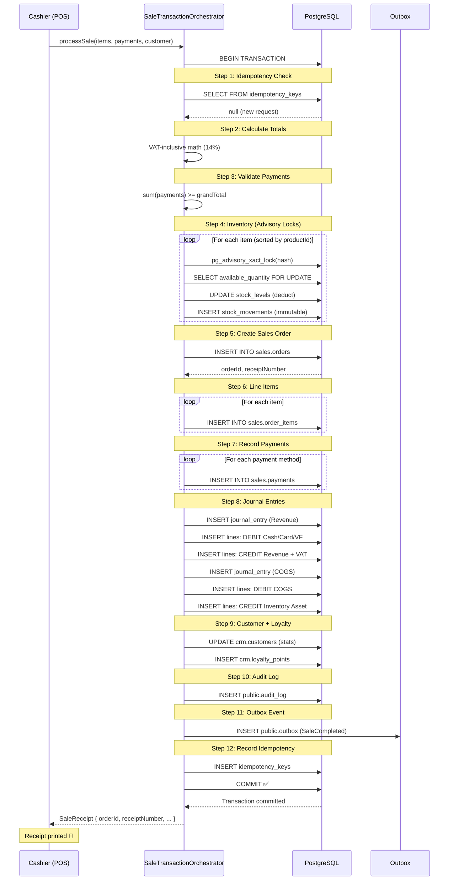

# Critical Workflow: Complete POS Sale

## Transaction Flow



## Atomicity Guarantees

| Scenario | Behavior |
|---|---|
| Insufficient stock | ROLLBACK — no order, no payment, no JE |
| Insufficient payment | ROLLBACK — nothing changes |
| DB connection lost mid-transaction | ROLLBACK — PostgreSQL auto-rollback |
| Duplicate idempotency key | Return cached receipt — no re-processing |
| Concurrent sale for same product | Advisory lock serializes — safe |

## Journal Entry Structure

### Revenue Entry
```
DEBIT  1101 Cash Box           1,000.00
DEBIT  1103 Vodafone Cash      1,525.00
CREDIT 4101 Sales Revenue      2,127.19
CREDIT 2301 VAT Output           297.81
```

### COGS Entry
```
DEBIT  5101 Cost of Goods Sold   920.00
CREDIT 1301 Inventory Asset      920.00
```

## Invariants Enforced

1. **Stock movements are immutable** — DB trigger blocks UPDATE/DELETE
2. **Journal entries must balance** — debit_total = credit_total (DB trigger)
3. **Posted JEs cannot be modified** — only voided
4. **Advisory locks prevent overselling** — sorted to prevent deadlocks
5. **Idempotency keys prevent double-charge** — 24hr TTL
6. **RLS isolates tenant data** — SET LOCAL app.tenant_id
7. **Negative stock blocked** — CHECK constraint on stock_levels
